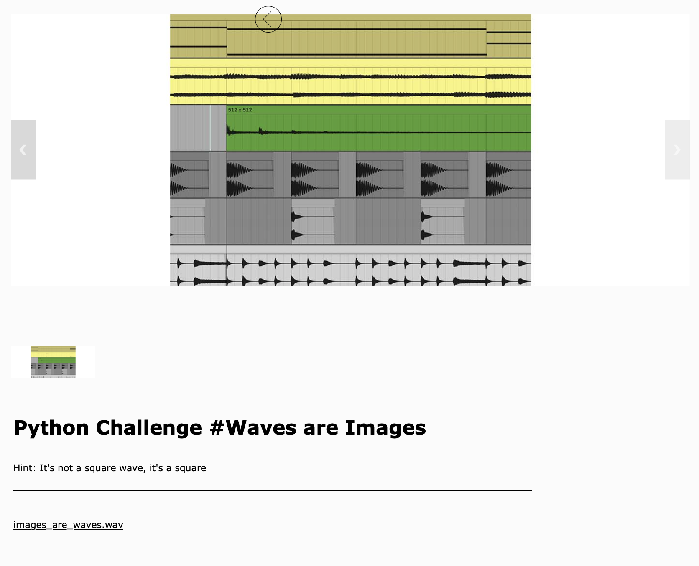
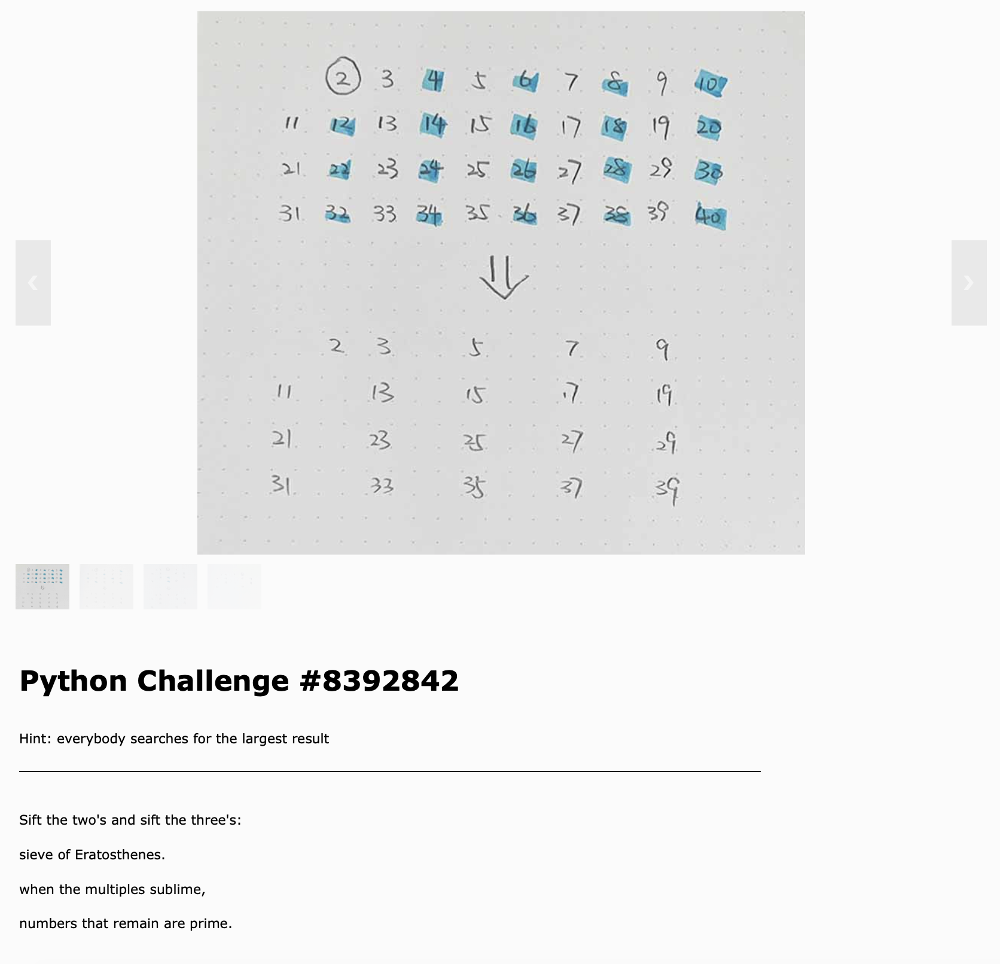

# Weekly Assessment 🦔    
###### Coding Two: Advanced Frameworks    
Jasper Zheng (Shuoyang)  

[Full Git Repository](https://github.com/jasper-zheng/msc-coding-2-jasper-zheng)  

## Week 02: Channel Vocoder by ofxMaxim

https://user-images.githubusercontent.com/74963879/151467762-3894d031-d4b9-4211-9627-e98a467986e5.mp4  

[Git](https://github.com/jasper-zheng/msc-coding-2-jasper-zheng/tree/main/week_02)  

This is a 30-band vocoder implemented in openFrameworks using [Maximilian](https://github.com/micknoise/Maximilian) library.  

#### Implementation  
Shown in the diagram above, where the modulator is the original vocal (plus another pitched down voice just to have more low end), the carrier is a group of sqare waves, `n = 30`. The bandpass filters and the envelope followers are using classes in the Maximilian library.
  
[↑ Img Reference](https://sethares.engr.wisc.edu/vocoders/channelvocoder.html)   

## Week 03: Two Group of Boids with Noises  

https://user-images.githubusercontent.com/74963879/152512112-9aa08c81-d647-4e95-8afa-a5d77a187547.mp4

[Git](https://github.com/jasper-zheng/msc-coding-2-jasper-zheng/tree/main/week_03)  

An implementation of boids with polymorphism class in openFrameworks.     


### Implementation  

##### Polymorphism   

In `boid.h`:

```
virtual void draw();
```  

In `ofApp.cpp`:  

```
for (int i = 0; i < 300; i++){
        boids.push_back(new Boid());
    }
    for (int i = 0; i < 100; i++){
        Boid * thisObs = new Obstacle;
        obstacles.push_back(thisObs);
    }
```

##### Draw Triangles  
</img>


##### X,Y -> frequency and amplitude  
```
for (int i = 0; i < output.getNumFrames(); ++i){

        double wave = osc1.sinewave(boids[5]->getPosition().x)*boids[5]->getPosition().y/800 +
                      osc2.sinewave(boids[50]->getPosition().x)*boids[50]->getPosition().y/800 +
                      osc3.sinewave(boids[20]->getPosition().x)*boids[20]->getPosition().y/800 +
                      osc4.sinewave(obstacles[20]->getPosition().x)*obstacles[20]->getPosition().y/800 +
                      osc5.sinewave(obstacles[10]->getPosition().x)*obstacles[10]->getPosition().y/800 +
                      osc6.sinewave(obstacles[70]->getPosition().x)*obstacles[70]->getPosition().y/800 +
                      osc7.sinewave(boids[200]->getPosition().x)*boids[200]->getPosition().y/800 +
                      osc8.sinewave(boids[280]->getPosition().x)*boids[280]->getPosition().y/800;
        output[i * outChannels] = wave/10;
        output[i * outChannels + 1] = output[i * outChannels];
```

## Week 05: Python Challenges with DCT and the Sieve of Eratosthenes  

[Git](https://github.com/jasper-zheng/msc-coding-2-jasper-zheng/tree/main/week_05)  

</img>  
[Level 001](https://alaskawinter.cc/python-challenges/001)   
[Jupyter Notebook Solution](https://github.com/jasper-zheng/msc-coding-2-jasper-zheng/blob/main/week_05/python-challenges/sol/waves_are_images_solution.ipynb)  

</img>    
[Level 002 (with solution)](https://alaskawinter.cc/python-challenges/002)   

## Week 0708: DCGAN Trained on NASA's Space Images  
[Git](https://github.com/jasper-zheng/msc-coding-2-jasper-zheng/tree/main/week_0708)   
I trained a GAN model trained on 1k+ Hubble Space Telescope images.  

https://user-images.githubusercontent.com/74963879/158636189-7a6c68d3-4a56-4a22-8216-6d70290da13d.mp4  

</img>  

### Implementation  

[Jupyter Notebook](./GAN_on_space_image.ipynb)   

```
Model: "sequential_1"
_________________________________________________________________
Layer (type)                 Output Shape              Param #   
=================================================================
dense_1 (Dense)              (None, 3200)              323200    
_________________________________________________________________
leaky_re_lu_7 (LeakyReLU)    (None, 3200)              0         
_________________________________________________________________
reshape (Reshape)            (None, 5, 5, 128)         0         
_________________________________________________________________
conv2d_transpose (Conv2DTran (None, 10, 10, 128)       147584    
_________________________________________________________________
leaky_re_lu_8 (LeakyReLU)    (None, 10, 10, 128)       0         
_________________________________________________________________
conv2d_transpose_1 (Conv2DTr (None, 20, 20, 128)       147584    
_________________________________________________________________
leaky_re_lu_9 (LeakyReLU)    (None, 20, 20, 128)       0         
_________________________________________________________________
conv2d_transpose_2 (Conv2DTr (None, 40, 40, 128)       147584    
_________________________________________________________________
leaky_re_lu_10 (LeakyReLU)   (None, 40, 40, 128)       0         
_________________________________________________________________
conv2d_transpose_3 (Conv2DTr (None, 80, 80, 32)        36896     
_________________________________________________________________
leaky_re_lu_11 (LeakyReLU)   (None, 80, 80, 32)        0         
_________________________________________________________________
conv2d_transpose_4 (Conv2DTr (None, 160, 160, 16)      4624      
_________________________________________________________________
leaky_re_lu_12 (LeakyReLU)   (None, 160, 160, 16)      0         
_________________________________________________________________
conv2d_transpose_5 (Conv2DTr (None, 320, 320, 16)      2320      
_________________________________________________________________
leaky_re_lu_13 (LeakyReLU)   (None, 320, 320, 16)      0         
_________________________________________________________________
conv2d_transpose_6 (Conv2DTr (None, 640, 640, 16)      2320      
_________________________________________________________________
leaky_re_lu_14 (LeakyReLU)   (None, 640, 640, 16)      0         
_________________________________________________________________
conv2d_7 (Conv2D)            (None, 640, 640, 3)       771       
=================================================================
Total params: 812,883
Trainable params: 812,883
Non-trainable params: 0
_________________________________________________________________
```
