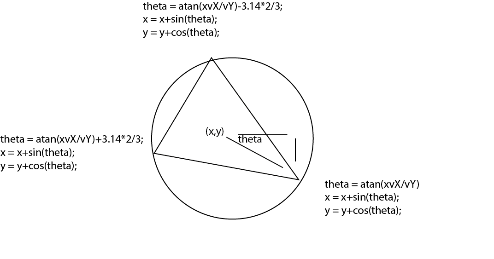

# Two Group of Boids with Noises  

https://user-images.githubusercontent.com/74963879/152512112-9aa08c81-d647-4e95-8afa-a5d77a187547.mp4

### Implementation  

##### Group Interaction  

##### Triangles  
</img>

##### Sounnd  
